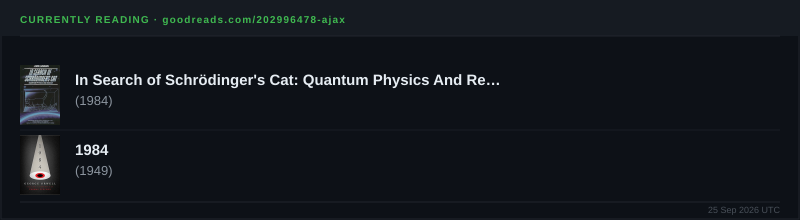
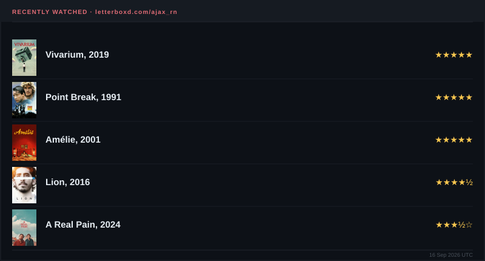

<!--
  @raximnuraliyev
-->


<div align="center">
<a href="https://git.io/typing-svg">
  
</a>
<br>

</div>

```yaml
name:      Rakhim Nuraliyev
education: PDP University — B.S. Software Development
age:       19

experience:
  - { role: Software Engineering Intern,  org: UIC Games        }
  - { role: Full-Stack Developer,          org: BOGATIR Textile  }

events:
  - GameFest 2026
  - ETHOnline Hackathon
  - 35 LVL Game Jam
  - GDG DevFest Uzbekistan 2025
  - GDG Build with AI — EdTech Hackathon & Ideathon
  - PAYNET x ITPU Hackathon 2026   # Team Mars
```


<div align="center">

### Reach Me At

<a href="mailto:unityhub1149@gmail.com"></a> <a href="https://t.me/rakhimnuraliyev"></a> <a href="https://discord.com/users/rn.ajax"></a> <a href="https://www.linkedin.com/in/rakhimnuraliyev"></a>

</div>


<div align="center">

### Stack

           

</div>


<div align="center">

### Stats

<a href="https://leetcode.com/ajax_rn"></a> <a href="https://codeforces.com/profile/ajax_rn"></a>
<br>
<a href="https://www.goodreads.com/user/show/202996478-ajax"></a> <a href="https://www.last.fm/user/ajaxmanson"></a>
<br>
<a href="https://letterboxd.com/ajax_rn"></a>

</div>


