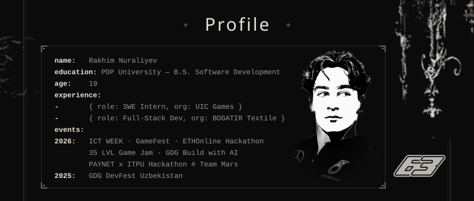
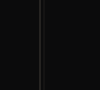
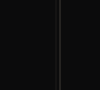
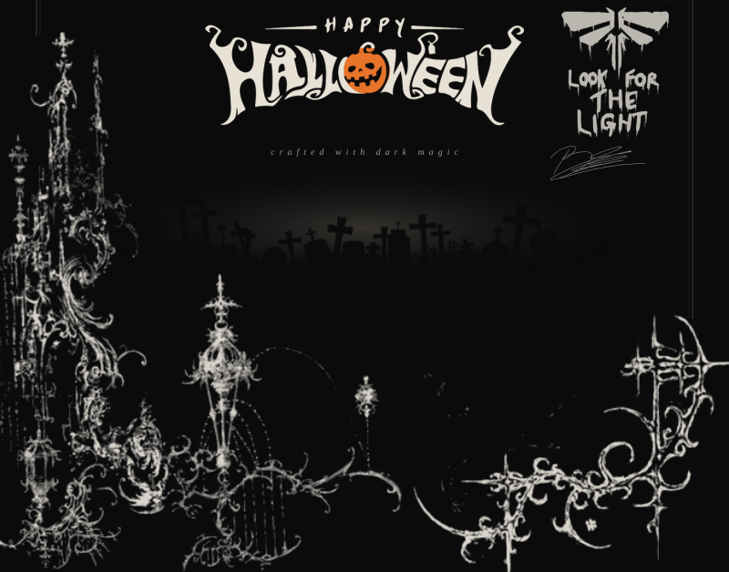

<!--
  @raximnuraliyev
  One continuous canvas: every image below is a slice of the same 800-wide
  dark page. Keep them in a single block with no blank lines between them,
  and keep align="top" — it removes the gap under inline images.
-->

